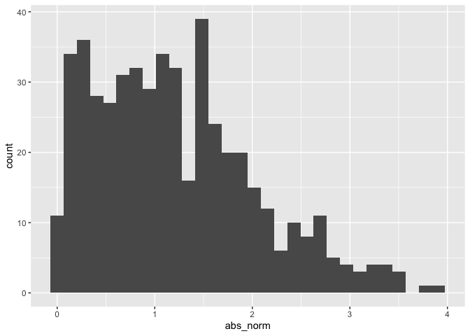

Simple document0915
================

I’m an R Markdown document! New

# Section 1

Here’s a **code chunk** that samples from a *normal distribution*:

``` r
samp = rnorm(100)
length(samp)
```

    ## [1] 100

# Section 2

I can take the mean of the sample, too! The mean is 0.02.

# Section 3

This is going to make a plot! First U generate a dataframe, then use
“ggplot” to make a scatterplot.

library(tidyverse)

# plot using ggplot

``` r
plot_df = 
  tibble(
    x = rnorm(n = 1000),
    y = 1 +2 * x^2 + rnorm(n = 1000)
  )

ggplot(plot_df, aes(x = x)) + geom_histogram()
```

    ## `stat_bin()` using `bins = 30`. Pick better value with `binwidth`.

<!-- -->

``` r
ggplot(plot_df, aes( x = x, y = y)) + geom_point()
```

<!-- -->

Section 4 Write a named code chunk that creates a dataframe comprised
of: a numeric variable containing a random sample of size 500 from a
normal variable with mean 1; a logical vector indicating whether each
sampled value is greater than zero; and a numeric vector containing the
absolute value of each element. Then, produce a histogram of the
absolute value variable just created. Add an inline summary giving the
median value rounded to two decimal places. What happens if you set eval
= FALSE to the code chunk? What about echo = FALSE?

Create a numeric variable containing a random sample of size 500 from a
normal variable with mean 1

``` r
la_df = 
  tibble(
    norm = rnorm(n = 500, mean = 1),
    logical = norm>0,
    abs_norm = abs(norm),
    round(median(norm),2)
)

ggplot(la_df, aes(x = abs_norm)) + geom_histogram()
```

    ## `stat_bin()` using `bins = 30`. Pick better value with `binwidth`.

<!-- -->

-   Key points
    -   Formatting

## Tables

| First Header | Second Header |
|--------------|---------------|
| Content Cell | Content Cell  |
| Content Cell | Content Cell  |
